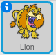

لإعادة تسمية كائن في Scratch، انقر فوق الرمز **i** الموجود على الكائن:

يؤدي ذلك إلى فتح اللوحة **معلومات**. يمكنك أيضًا النقر فوق الكائن بزر الماوس الأيمن واختيار `info`.

يمكنك تحرير اسم الكائن ثم النقر فوق **المثلث** لإغلاق اللوحة **معلومات**.