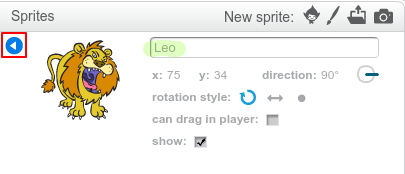

За да преименувате даден sprite на Scratch, кликнете върху **i** на спрата:

Отваря се панелът **информация**. Можете също така да кликнете с десния бутон върху даден sprite и да изберете `info`.

Можете да редактирате името на спрайт и след това щракнете върху **триъгълника** , за да затворите **информация** панел.