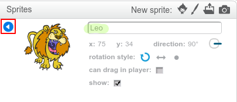

Chcete-li přejmenovat skřítku na Scratch, klepněte na tlačítko **i** na sprite:

Otevře se panel **info**. Můžete také kliknout pravým tlačítkem na sprite a zvolit `info`.

Můžete upravit název sprite a poté kliknout na **trojúhelník** a zavřít panel **info**.