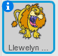
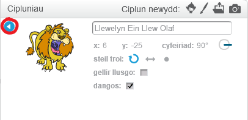

I ail-enwi swite yn Scratch, cliciwch ar y **i** ar y chwistrell:

Mae hyn yn agor y panel **info**. Gallwch hefyd dde-glicio ar sbring a dewis `gwybodaeth`.

Gallwch olygu enw'r corlun ac yna cliciwch y **triongl** i gau'r **info** panel.