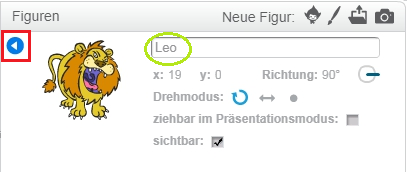

Um ein Sprite in Scratch umzubenennen, klicke auf den **i** auf dem Sprite:

Dies öffnet das **-Info-** -Feld. Du kannst auch mit der rechten Maustaste auf eine Figur klicken und `info` auswählen.

Du kannst den Namen der Figur bearbeiten und dann auf das **Dreieck** klicken, um das **Info** -Feld zu schließen.