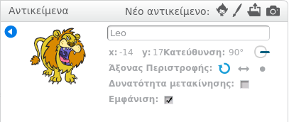

Για να μετονομάσετε ένα sprite στο Scratch, κάντε κλικ στο **i** του sprite:

Αυτό ανοίγει το πάνελ **info**. Μπορείτε επίσης να κάνετε δεξί κλικ σε ένα sprite και να επιλέξετε `info`.

Μπορείτε να επεξεργαστείτε το όνομα του sprite και στη συνέχεια να κάνετε κλικ στο **τρίγωνο** για να κλείσετε το πάνελ **info**.