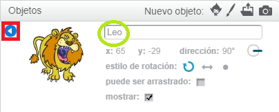

Para renombrar un objeto en Scratch, haz clic en la **i** del objeto:

Esto abre el panel **info**. También puedes hacer clic con el botón derecho en un objeto y luego elegir `info`.

Puedes editar el nombre del objeto y luego hacer clic en el **triángulo** para cerrar el panel **info**.