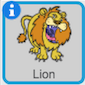

برای تغییر نام یک شبح در اسکرچ، روی **i** که روی شبح می بینید کلیک کنید:

این پانل **info** را باز می کند. شما همچنین می توانید روی شبح کلیک راست کنید و `info` را انتخاب کنید.

اینجا می توانید نام شبح را ویرایش کنید. سپس برای بستن پانل **info** روی **مثلث** کلیک کنید.