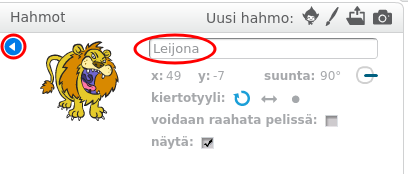

Jos haluat nimetä Scratch-hahmon uudelleen, napsauta hahmoa **i**:

Tämä avaa **info** paneelin. Voit myös napsauttaa hiiren oikealla painikkeella ja valita `info`.

Voit muokata nimeä sprite ja valitse **kolmiota** Sulje **info** paneeli.