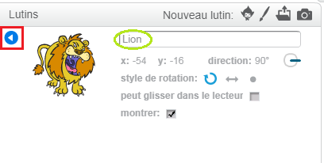

Pour renommer un lutin dans Scratch, clique sur le **i** sur le lutin:

Cela ouvre le panneau **info**. Tu peux également cliquer avec le bouton droit sur un lutin et choisir `info`.

Tu peux modifier le nom du lutin, puis cliquer sur le **triangle** pour fermer le panneau **info**.