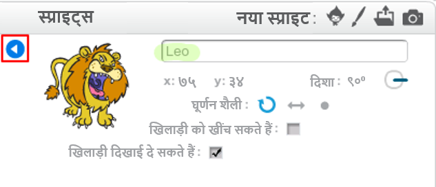

Scratch में एक स्प्राइट का नाम बदलने के लिए, **i** पर क्लिक करें

यह **info** कक्ष खोलता है । आप स्प्राइट पर राइट-क्लिक भी कर सकते हैं और `info` चुन सकते हैं ।

आप स्प्राइट के नाम को संपादित कर सकते हैं और फिर **info** पैनल को बंद करने के लिए **triangle** पर क्लिक करे ।