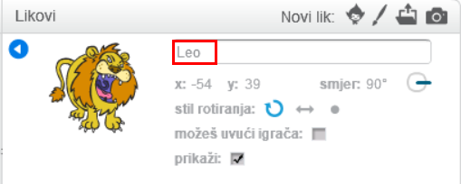

Za preimenovanje lika u Scratchu, klikni na **i** na liku:

Tako ćeš otvoriti **info** ploču. Također možeš kliknuti desnom tipkom miša na lika i odabrati `info`.

Možeš urediti naziv lika, a zatim kliknuti na **trokut** za zatvaranje **info** ploče.