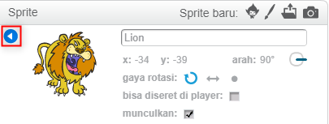

Untuk mengganti nama sprite di Scratch, klik pada **i** pada sprite:

Ini akan membuka panel **info**. Anda juga dapat mengklik kanan pada sprite dan memilih `info`.

Anda dapat mengedit nama sprite dan kemudian klik segitiga **** untuk menutup panel **info**.