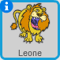
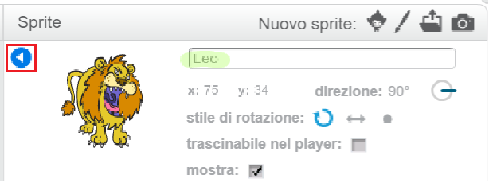

Per rinominare uno sprite in Scratch, fai clic sulla **i** che si trova sullo sprite:

Così facendo si aprirà il pannello **informazioni**. Puoi anche fare clic con il tasto destro su uno sprite e scegliere `info`.

Modifica il nome dello sprite e poi fai click sul **triangolo** per chiudere il pannello **info**.