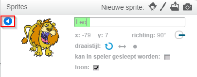

Om de naam van een sprite in Scratch te wijzigen, klikt u op de **i** op de sprite:

Hiermee wordt het paneel **info**. U kunt ook met de rechtermuisknop op een sprite klikken en `info`.

U kunt de naam van de sprite bewerken en vervolgens op de **driehoek** klikken om het paneel met **info** te sluiten.