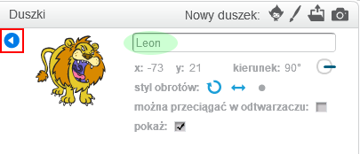

Aby zmienić nazwę duszka w Scratchu, kliknij **i** na duszku:

Spowoduje to otwarcie panelu **info**. Możesz także nacisnąć prawy przycisk myszy nad duszkiem i wybrać `info`.

Możesz zmienić nazwę duszka, a następnie kliknąć **trójkąt**, aby zamknąć panel **info**.