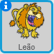
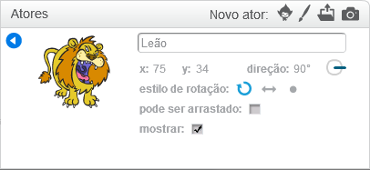

Para renomear um ator no Scratch, clique no **i** no sprite:

Isso abrirá o painel **informações**. Você também pode clicar com o botão direito em um ator e selecionar `info`.

Você pode editar o nome do ator e, em seguida, clicar no **triângulo** para fechar o painel de **informações**.