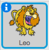
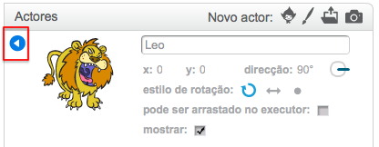

Para renomear um sprite no Scratch, clique no **i** no sprite:

Isso abre o painel **info**. Você também pode clicar com o botão direito em um sprite e escolher `info`.

Você pode editar o nome do sprite e depois clicar no triângulo **** para fechar o painel **info**.