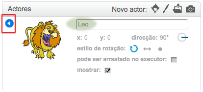

Para renomear um actor no Scratch, clica no **i** no actor:

Assim abres o painel **info**. Também podes clicar com o botão direito em um actor e escolher `info`.

Podes editar o nome do actor e depois clicar no **triângulo** para fechar o painel **info**.