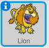
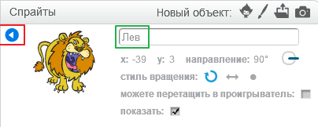

Чтобы переименовать спрайт в Scratch, нажми на кнопку-букву **i**, которая находится в уголке этого спрайта:

Откроется панель **info**. Ты также можешь щёлкнуть правой кнопкой мыши по спрайту и выбрать в меню пункт `info`.

Ты можешь отредактировать имя спрайта, а затем нажать **треугольник** чтобы закрыть панель **info**.