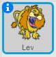
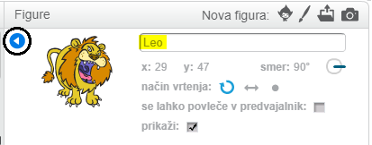

Če želite preimenovati sprite v Scratch, kliknite na **i** na sprite:

S tem se odpre plošča **info**. Prav tako lahko z desno miškino tipko kliknete sprite in izberete `info`.

Sprite ime lahko uredite in nato kliknete **trikotnika** da zaprete ploščo **info**.