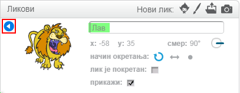

Да преименујете сприте у Сцратцх, кликните на **и** на сприте:

Ово отвара панел **инфо**. Такође можете да кликнете десним тастером миша на сприте и изаберете `инфо`.

Можете да измените име сприте и затим кликнете на **троугао** да бисте затворили панел **инфо**.