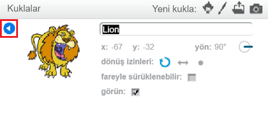

Scratch'te bir kuklanın ismini değiştirmek için kukla üzerindeki **i** işaretine tıklayın:

Bu işlem, **info** panelini açacaktır. Bir hareketli grafiğe de sağ tıklayıp `bilgi`seçebilirsiniz.

Burada kuklanın adını düzenleyebilir ve ardından **info** panelini kapatmak için **üçgen** üzerine tıklayabilirsiniz.